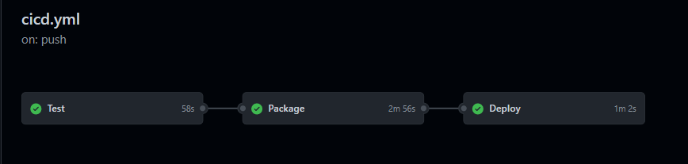

# NestJs Backend Template

## About The project

This repository contains implemented functionalities that can be reused and extended as required.

### Built With

* [NestJs](https://nestjs.com/), the progressive Node.js framework for building server-side applications.
* [Postgresql](https://www.mongodb.com/fr-fr), Relational database.
* [NPM](https://www.npmjs.com/) as package manager.

### Testing Tools

* [JEST](https://jestjs.io/fr/), a quality testing framework.
* [Cypress](https://www.cypress.io/), an end to end testing tool.

### Containerization Solution

* [Docker](https://www.docker.com/), a solution for building,sharing and running application images.

## Getting Started

In order to run this project and extend its functionalities you need to follow some few steps :

### Prerequisites

* Make sure that Node.js (>= 10.13.0, except for v13) is installed on your operating
  system. ( [Download Here](https://nodejs.org/en/download/))
* NestJs CLI (Command Line Interface)
  ```sh
  npm i -g @nestjs/cli
  ```

### Installation

1. make sure you have docker installed.
2. pull the image :

 ``` sh
 docker pull mehdibc/todo-app
 ```

3. run the following docker run command:

  ```
 docker pull and  mehdibc/todo-app
 ``` sh
 sudo docker run -d -p 3000:3000 --name todo-app mehdibc/todo-app
 ```

## Tests

- you can run all the tests at once using

```sh
   npm run test
   ```

or select the file test

```sh
   npm run test -- testfile.spec.ts
   ```

)

Unit test and integration test scripts are under every module (user | task) under tests directory

### System testing

We need to run the application before the end to end testing

```sh
   npm run cypress:open
   ```

)

### User acceptance test

This acceptance test is done by the product owner to make sure that the solution works as expected.  
Link: [a link] (https://github.com/MehdiBC/Todo-list-backend/blob/master/documentation/UAT.pdf)

## CI/CD pipeline

The project pipeline code can be found under `.github/workflows` and its structure is as follows


### Third phase

This part of the pipeline is **deployment** and depends on the packaging phase. The project is deployed on
an [Amazon](https://aws.amazon.com/) Ec2 instance.  
It follows these steps:  
1- Login to the instance via **SSH**.  
2- Shut down the running container.  
3- Pull the new released image.  
4- Launch a new container via `docker run` command with port and name of the container specification.

In order to access the site a **security groups** must be added with TCP on PORT 80.  
